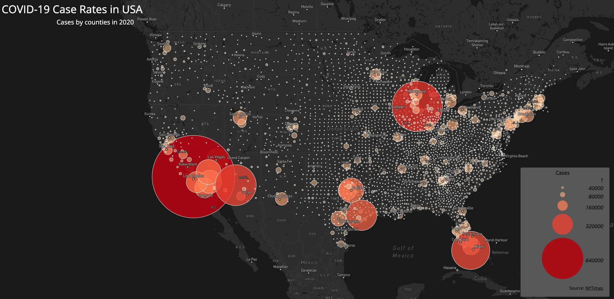
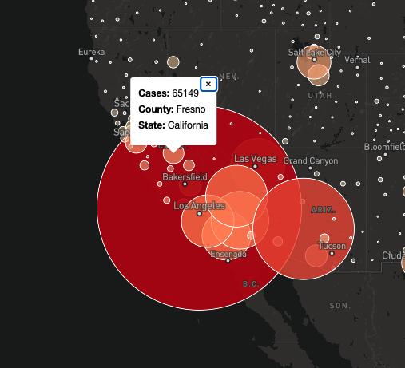

# mapbox-covid-distribution
A set of two maps visualizing Covid 19 cases in 2020 across US Census counties to compare impact by region.

## Data Sources
The COVID cases data is pertinent to the year 2020 and is collected from a broader data set available from [New York Times](https://github.com/nytimes/covid-19-data/blob/43d32dde2f87bd4dafbb7d23f5d9e878124018b8/live/us-counties.csv). To obtain the corresponding population data for each county, we used the [2018 ACS 5 year estimates](https://data.census.gov/cedsci/table?g=0100000US.050000&d=ACS%205-Year%20Estimates%20Data%20Profiles&tid=ACSDP5Y2018.DP05&hidePreview=true) and obtained the shapefile data for counties from [the U.S. Census Bureau](https://www.census.gov/geographies/mapping-files/time-series/geo/carto-boundary-file.html).

## Audience
These maps can be used by healthcare workers, people who are planning to move, census team, etc.

## Map 2: Proportional Distribution of COVID cases by counties

This map of the contiguous USA depicts the the impact of COVID-19 for every county. It plots the number of cases in each county. You can access the dynamic version of this map [here](https://ranv1r.github.io/mapbox-covid-distribution/map2.html).

#### Functions
 - This map depcits each counties cases by circles. The larger the circle, the higher the cases in that county. The hue and opacity of the circle change with the cases as well.
 - When you hover over a particular circle, a popupshowing details of that county comes up.
 

## Libraries In Use

- Mapbox JS

## Credit

This project was created as part of the GEOG458: Advanced Spatial Geographies Lab and would not have been possible without the help of our professor Bo Zhao and also without the help of Steven Bao.

